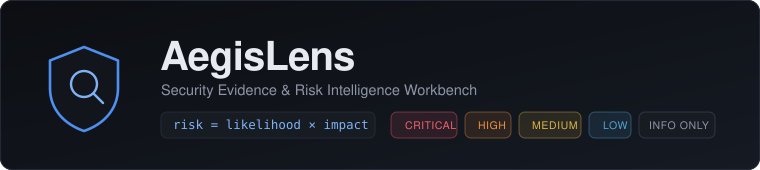
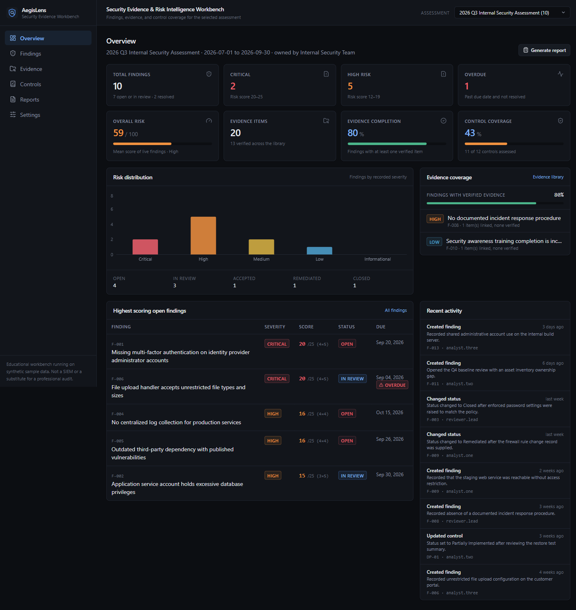
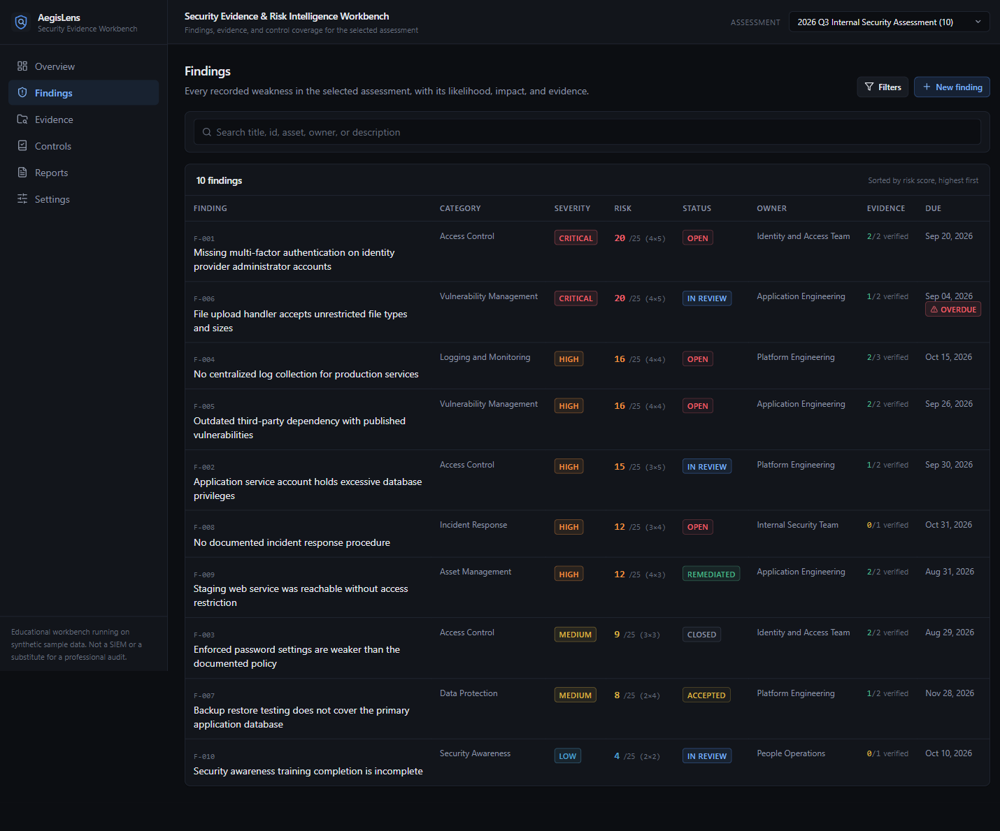
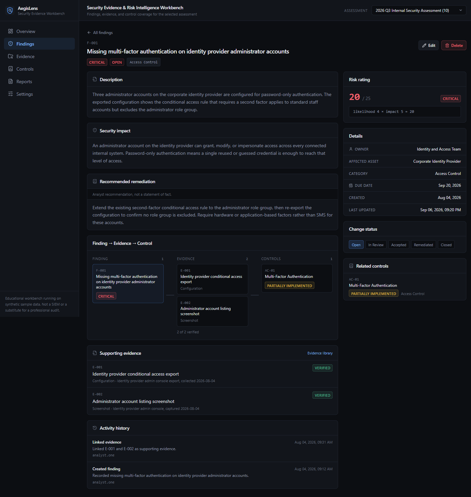
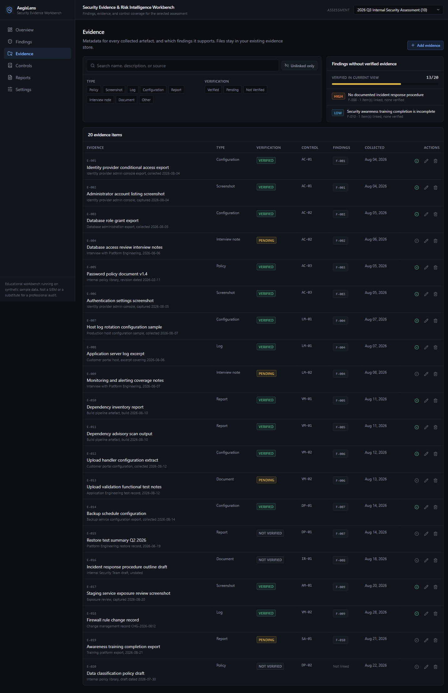
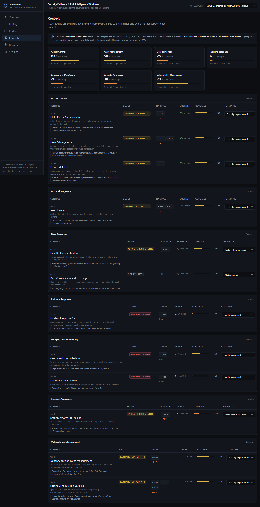
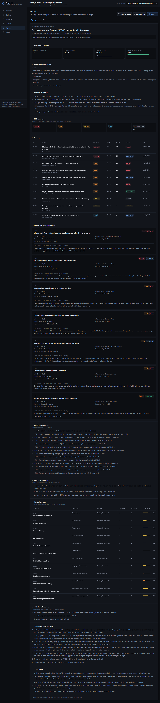
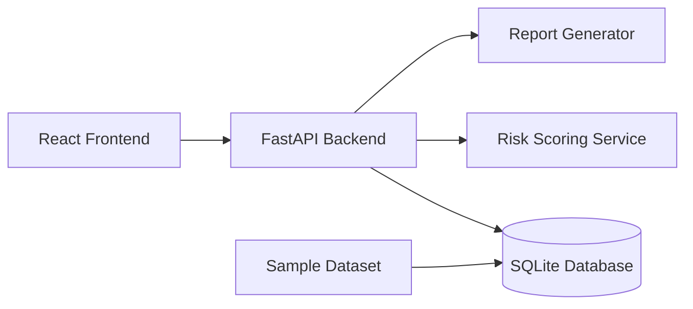

<div align="center">



### Security Evidence &amp; Risk Intelligence Workbench

AegisLens helps security teams organize security evidence, assess risks, track findings,
and generate professional security reports from uploaded sample data.

[](https://github.com/het-P301204/AegisLens-security-workbench/actions/workflows/ci.yml)
[](LICENSE)
[](backend/requirements.txt)
[](frontend/package.json)
[](backend/tests)

**[Features](#what-aegislens-does)** &nbsp;·&nbsp;
**[Screenshots](#screenshots)** &nbsp;·&nbsp;
**[Quick start](#getting-started)** &nbsp;·&nbsp;
**[Risk model](#risk-scoring)** &nbsp;·&nbsp;
**[Docs](docs/)**

</div>

---

> **AegisLens is an educational and defensive security assessment workbench using
> synthetic data. It is not a replacement for a SIEM, GRC platform, vulnerability
> scanner, or professional security audit.**

## Contents

- [The problem](#the-problem)
- [What AegisLens does](#what-aegislens-does)
- [Screenshots](#screenshots)
- [Architecture](#architecture)
- [Technology](#technology)
- [Getting started](#getting-started)
- [Running with Docker](#running-with-docker)
- [A worked example](#a-worked-example)
- [API](#api)
- [Risk scoring](#risk-scoring)
- [Sample dataset](#sample-dataset)
- [Testing](#testing)
- [Security](#security)
- [Limitations](#limitations)
- [Roadmap](#roadmap)
- [Why this project matters](#why-this-project-matters)
- [Contributing](#contributing)
- [License](#license)

## The problem

Security evidence arrives scattered. A configuration export sits in one folder, the
screenshot proving the setting is wrong is in a chat thread, the policy it
contradicts is in a document library, and the interview note explaining why nobody
fixed it is in someone's notebook. By the time a report is due, the analyst is
reconstructing an argument from fragments and hoping nothing was missed.

AegisLens pulls that material into one workspace so seven questions have answers you
can point at:

1. What security findings exist?
2. How serious is each one, and why that rating?
3. What evidence supports each finding?
4. Which controls or security areas are affected?
5. What is still missing?
6. What should be done next?
7. Can a professional report be generated from this?

## What AegisLens does

**Dashboard** — findings by severity and status, open versus resolved, an aggregate
risk indicator, evidence completion, control coverage, overdue items, the highest
scoring open findings, evidence gaps, and recent activity. Every figure is computed
from current records, never hardcoded.

**Findings** — full CRUD with search across title, id, asset, owner and description,
plus filters on severity, status and category. Each finding carries a description,
security impact, recommended action, owner, affected asset, due date, linked
evidence, related controls, and an activity history.

**Risk scoring** — `likelihood × impact` on a 1–5 scale, recalculated by the server
on every write. The formula and its bands are explained inside the application on the
Settings page, and where an analyst's recorded severity disagrees with the score,
AegisLens shows both rather than silently overruling either.

**Evidence library** — metadata for every artefact, its type, source, verification
status, related control and linked findings. It also answers the question that
matters most in a review: *which findings have nothing verified behind them?*

**Controls** — a small, clearly labelled illustrative framework across seven
security areas, with linked findings, evidence counts, and a coverage figure that
weights recorded status against verified evidence.

**Finding detail** — everything about one finding on one page, including a
`Finding → Evidence → Control` relationship view drawn with plain cards and
connectors.

**Reports** — a twelve-section assessment report generated from the current data,
available as an in-app preview, Markdown (copy or download), and a printable view
that browsers save straight to PDF. The report separates confirmed evidence, analyst
assessment, recommendations, and missing information — and never claims a weakness
was exploited.

## Screenshots

Capture instructions and image slots are in [`screenshots/`](screenshots/).

| Overview | Findings |
| --- | --- |
|  |  |

| Finding detail | Evidence library |
| --- | --- |
|  |  |

| Control coverage | Report |
| --- | --- |
|  |  |

## Architecture



One FastAPI process, one SQLite file, one React bundle. In development Vite proxies
`/api` to the backend; in production FastAPI serves the built bundle itself, so the
whole application is a single container with no reverse proxy to configure.

See [`docs/architecture.md`](docs/architecture.md) for the request path, the data
model, and the reasoning behind each choice.

```text
aegislens/
├── backend/            FastAPI application, services, and tests
│   ├── app/
│   │   ├── routers/    dashboard, findings, evidence, controls, reports
│   │   └── services/   risk scoring, serializers, ids, report generation
│   └── tests/          108 pytest tests
├── frontend/           React + TypeScript + Vite + Tailwind client
├── sample-data/        Synthetic seed dataset (JSON, easy to edit)
├── scripts/            Sample data validator used by CI
├── docs/               Architecture, risk model, security, limitations
└── screenshots/
```

## Technology

| Layer | Choice |
| ----- | ------ |
| Backend | Python 3.11+, FastAPI, Pydantic v2, SQLAlchemy 2, SQLite |
| Frontend | React 18, TypeScript, Vite, Tailwind CSS, Recharts, Lucide icons |
| Testing | pytest |
| Delivery | Docker, Docker Compose, GitHub Actions |

Dependencies are pinned to exact versions. There is no Kubernetes, no message broker,
no cache layer, and no second service.

## Getting started

**Requirements:** Python 3.11 or newer, and Node.js 20 or newer.

```bash
git clone https://github.com/het-P301204/AegisLens-security-workbench.git
cd AegisLens-security-workbench
```

Prefer not to install anything? Skip to [Running with Docker](#running-with-docker) —
one command and you are done.

### 1. Backend

```bash
cd backend
python -m venv .venv
```

Activate it — macOS/Linux `source .venv/bin/activate`, Windows PowerShell
`.venv\Scripts\Activate.ps1` — then:

```bash
pip install -r requirements.txt
uvicorn app.main:app --reload --port 8000
```

The sample dataset loads automatically the first time the database is empty. The API
is now on <http://127.0.0.1:8000> with interactive docs at
<http://127.0.0.1:8000/api/docs>.

### 2. Frontend

In a second terminal:

```bash
cd frontend
npm install
npm run dev
```

Open <http://localhost:5173>. The dev server proxies `/api` to port 8000.

### 3. Single-origin mode (optional)

Build the frontend once and the backend will serve it directly, so you only need the
one process:

```bash
cd frontend && npm run build
cd ../backend && uvicorn app.main:app --port 8000
```

Everything is then on <http://127.0.0.1:8000>.

### Reloading the sample data

```bash
cd backend
python -m app.seed --force     # deletes existing rows and reloads sample-data/
```

### Configuration

Every setting has a working default. Copy [`.env.example`](.env.example) to `.env`
only if you want to change one. There are no secrets to supply — AegisLens has no
authentication and no external integrations.

## Running with Docker

```bash
docker compose up --build
```

Then open <http://localhost:8000>. The image builds the frontend, installs the
backend, runs as an unprivileged user, and keeps the SQLite file on a named volume so
your findings survive a rebuild.

```bash
docker compose down          # stop
docker compose down -v       # stop and discard the database
```

## A worked example

A short tour that exercises the whole product, using the seeded data:

1. **Overview** — the 2026 Q3 assessment shows 10 findings, 2 Critical, an aggregate
   risk indicator of 59/100, and evidence completion at 80%. Two findings appear in
   the evidence gap panel.
2. **Click `F-008`** in that panel. It is a High-severity finding about a missing
   incident response procedure. Its only evidence, `E-016`, is an outline draft
   marked *Not Verified* — which is exactly why it is flagged.
3. **Look at the relationship view** on that page: the finding links to one piece of
   evidence, which maps to control `IR-01`, which is *Not Implemented*. The whole
   argument is visible in one row.
4. **Open Evidence** and mark `E-019` (the awareness training export) as Verified.
   Return to the Overview: evidence completion moves from 80% to 90% and the gap
   panel drops an entry.
5. **Open Controls** and set `LM-01` to Partially Implemented. Coverage for Logging
   and Monitoring rises, but not to 100% — the status only carries 60% of the figure,
   and the rest depends on verified evidence.
6. **Create a finding** with likelihood 4 and impact 5. The form shows `4 × 5 = 20`
   and *Critical* before you save; the server calculates the same value independently.
7. **Open Reports.** The new finding is in the findings table and, being Critical, in
   the priority section. Section 10 lists it under missing information because it has
   no evidence yet. Download the Markdown, or open the print view and save a PDF.
8. **Switch assessment** in the header to *2026 Q4 Baseline Readiness Review* to see
   how the whole workspace looks with a barely started assessment.

## API

Interactive OpenAPI docs are served at `/api/docs`, with the raw schema at
`/api/openapi.json`.

| Method | Endpoint | Purpose |
| ------ | -------- | ------- |
| `GET` | `/api/health` | Liveness plus a database connectivity check |
| `GET` | `/api/dashboard` | All overview statistics for an assessment |
| `GET` | `/api/findings` | List with search, filters, and sorting |
| `POST` | `/api/findings` | Create a finding (risk score is derived) |
| `GET` | `/api/findings/{id}` | Detail with evidence, controls, and history |
| `PUT` | `/api/findings/{id}` | Partial update, recalculates the risk score |
| `PATCH` | `/api/findings/{id}/status` | Change status only |
| `DELETE` | `/api/findings/{id}` | Delete a finding |
| `GET` | `/api/findings/{id}/evidence` | Evidence linked to one finding |
| `GET` | `/api/evidence` | List with search and filters |
| `POST` | `/api/evidence` | Record an evidence item |
| `PUT` | `/api/evidence/{id}` | Update, including verification and links |
| `DELETE` | `/api/evidence/{id}` | Delete an evidence item |
| `GET` | `/api/evidence/coverage` | Findings without verified evidence |
| `GET` | `/api/controls` | Controls with coverage and linked findings |
| `GET` | `/api/controls/categories` | Per-category coverage rollup |
| `PUT` | `/api/controls/{id}` | Update status or notes |
| `GET` | `/api/reports/summary` | Structured report data |
| `GET` | `/api/reports/markdown` | Markdown report (`?download=true` to save) |
| `GET` | `/api/reports/print` | Printable HTML for browser PDF export |
| `GET` | `/api/assessments` | Assessments for the selector |
| `PUT` | `/api/assessments/{id}` | Edit scope, assumptions, and metadata |
| `POST` | `/api/assessments/{id}/activate` | Set the assessment for new findings |
| `GET` | `/api/assets` | In-scope assets |
| `GET` | `/api/activity` | Recent workbench activity |
| `GET` | `/api/vocabulary` | Allowed values for form dropdowns |
| `GET` | `/api/risk-model` | The formula, bands, and metric definitions |

Example:

```bash
curl -X POST http://127.0.0.1:8000/api/findings \
  -H 'Content-Type: application/json' \
  -d '{
        "title": "Service account keys are not rotated",
        "category": "Access Control",
        "severity": "High",
        "likelihood": 3,
        "impact": 4,
        "owner": "Platform Engineering"
      }'
```

The response includes `"risk_score": 12`, `"risk_level": "High"`, and
`"severity_matches_score": true`. Supplying `risk_score` in the request has no
effect — it is always derived.

## Risk scoring

```text
Risk Score = Likelihood × Impact        (each 1–5, so the score is 1–25)
```

| Level | Score |
| ----- | ----- |
| Critical | 20–25 |
| High | 12–19 |
| Medium | 6–11 |
| Low | 3–5 |
| Informational | 1–2 |

```text
Likelihood: 4
Impact:     5
Risk Score: 20
Risk Level: Critical
```

The score is recalculated server-side on every write, so it cannot drift from its
inputs. A finding also stores an analyst-chosen severity; when the two disagree,
AegisLens shows both on the finding, in the table, and in the report rather than
quietly overwriting one — the disagreement is information, not an error.

Aggregate risk, evidence completion, and control coverage are defined with the same
level of transparency in [`docs/risk-model.md`](docs/risk-model.md).

## Sample dataset

The workbench is populated on first run from plain JSON in
[`sample-data/`](sample-data/): 2 assessments, 13 findings, 20 evidence items, 12
controls, 5 assets, and 15 activity records. Edit the files and run
`python -m app.seed --force` to reload.

All of it is synthetic. There are no real organizations, credentials, keys, personal
information, or private addresses. `scripts/validate_sample_data.py` runs in CI and
fails the build if the dataset develops broken cross-references, a severity that
disagrees with its score, or anything resembling sensitive content.

## Testing

```bash
cd backend
pip install -r requirements-dev.txt
pytest
```

108 tests covering the health endpoint, finding creation, update, status change and
deletion, risk score calculation, invalid severity values, out-of-range likelihood
and impact, evidence creation, finding–evidence linking, dashboard statistics,
control coverage, report generation, report output escaping, identifier reuse, and
empty-database behaviour.

Frontend type safety is enforced by `npm run typecheck`, and `npm run build` runs it
before bundling. CI runs the backend tests on Python 3.11, 3.12, and 3.13, builds the
frontend, validates the sample data, and builds and health-checks the Docker image.

## Security

AegisLens validates every input against fixed vocabularies, uses SQLAlchemy's bound
parameters throughout, returns field-level errors without leaking internals, sets
conservative response headers, escapes report text before rendering, contains no
secrets, and pins its dependencies. It has no authentication and is built for local
single-user use.

Full details, including what is deliberately *not* implemented and what you would
need to add before hosting it: [`docs/security.md`](docs/security.md). To report a
problem, see [SECURITY.md](SECURITY.md).

## Limitations

AegisLens detects nothing on its own, ships an illustrative control framework rather
than a real standard, uses a deliberately coarse risk model, and stores evidence
metadata without chain of custody. Reports are drafts for a human to review, not
assurance opinions. The full statement is in
[`docs/limitations.md`](docs/limitations.md) — worth reading before you rely on
anything here.

## Roadmap

Ideas that fit the project's scope, roughly in order of usefulness:

- CSV import and export for findings and evidence
- Per-assessment control scoping, so a review can target a subset of the framework
- A findings comparison view between two assessments to show what changed
- Optional single-user authentication for shared-machine use
- File attachment with size and type limits, kept outside the web-served path
- Mapping profiles to a real framework such as ISO/IEC 27001 Annex A or NIST CSF
- Frontend component tests with Vitest and Testing Library
- Database migrations with Alembic

Explicitly out of scope: live monitoring, vulnerability scanning, exploitation,
automatic remediation, multi-tenancy, and any offensive capability.

## Why this project matters

AegisLens demonstrates, in one small and finishable codebase:

- **Security finding management** — the full lifecycle from observation to closure,
  with a real status model and an activity trail
- **Risk assessment** — a transparent scoring model, applied consistently, that
  surfaces disagreement between judgement and arithmetic instead of hiding it
- **Evidence handling** — the distinction between *linked* and *verified*, and the
  discipline of reporting what could not be established
- **GRC thinking** — control coverage that refuses to reach 100% on an unevidenced
  claim, and reports that separate fact from assessment from recommendation
- **Backend API development** — a clean REST surface, layered services, dependency
  injection, and generated OpenAPI documentation
- **Database design** — a normalised schema with many-to-many relationships, derived
  values computed rather than stored, and identifiers that are never reused
- **Secure coding** — input validation at the boundary, parameterised queries, safe
  error messages, escaped output, security headers, and pinned dependencies
- **Report generation** — a structured document produced from live data in three
  formats, written to be honest about its own limits
- **Professional product design** — a dark, dense, keyboard-friendly interface with
  real loading, empty, and error states, responsive from phone to desktop

## Contributing

Contributions are welcome. See [CONTRIBUTING.md](CONTRIBUTING.md) for the setup, the
conventions this project follows, and the scope boundaries that keep it maintainable.

## License

[MIT](LICENSE).
