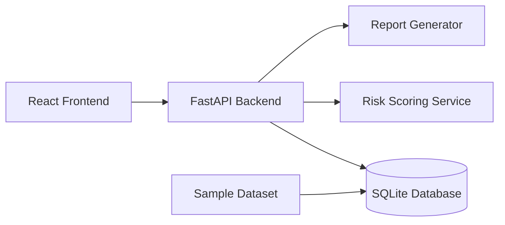
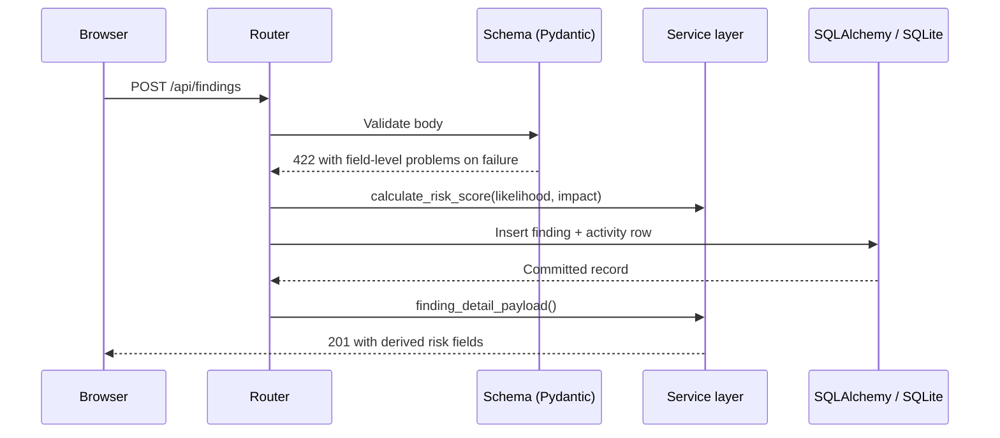
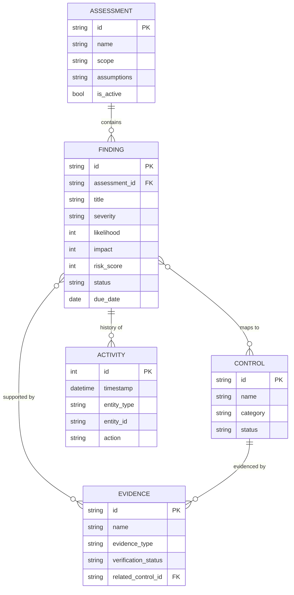

# Architecture

AegisLens is a monolith on purpose: one FastAPI process, one SQLite file, one React
bundle. There is nothing to orchestrate, and the whole thing runs offline once
dependencies are installed.

## Overview



In development the Vite dev server proxies `/api` to the backend. In production
(and in Docker) FastAPI serves the built bundle itself, so there is a single origin
and no CORS or reverse proxy to configure.

## Request path



Two things are worth calling out:

1. **Derived values are never stored twice.** Risk level, overdue status, evidence
   counts, and control coverage are computed at serialization time in
   `services/serializers.py`, so they cannot disagree with the underlying row.
2. **Every mutation writes an activity row** in the same transaction as the change,
   which is what makes the finding history trustworthy.

## Backend layout

```text
backend/app/
├── main.py                     # App factory, middleware, health, static serving
├── config.py                   # Environment-driven settings, no secrets
├── database.py                 # Engine, session factory, get_db dependency
├── models.py                   # SQLAlchemy ORM models
├── schemas.py                  # Pydantic request/response models and validation
├── seed.py                     # Loads sample-data/*.json into the database
├── routers/
│   ├── dashboard.py            # /api/dashboard, assessments, assets, vocabulary
│   ├── findings.py             # Finding CRUD, filtering, status changes
│   ├── evidence.py             # Evidence CRUD, verification, coverage gaps
│   ├── controls.py             # Control coverage and status updates
│   └── reports.py              # Structured, Markdown, and printable reports
└── services/
    ├── risk_service.py         # The risk formula, bands, and coverage arithmetic
    ├── serializers.py          # ORM rows -> enriched API payloads
    ├── ids.py                  # Sequential id allocation that never reuses ids
    ├── report_service.py       # Report assembly and Markdown rendering
    └── print_report.py         # Escaped, printable HTML rendering of the report
```

## Data model



Findings link to evidence and to controls through two association tables. Evidence
additionally carries a direct `related_control_id`, which is what control coverage
counts — a control can be evidenced without any finding existing against it.

### Identifier allocation

Findings and evidence use readable sequential ids (`F-014`, `E-021`). The next id is
derived from the live rows **and** the ids referenced in the activity log, so an id
belonging to a deleted record is never handed out again. Reuse would silently attach
one record's history to another, which is unacceptable in a tool whose point is
evidence integrity.

## Frontend layout

```text
frontend/src/
├── App.tsx                     # Routes and the workspace loading gate
├── types.ts                    # Mirrors backend/app/schemas.py
├── services/api.ts             # Typed fetch wrapper, ApiError with field problems
├── context/WorkspaceContext    # Assessments, vocabularies, risk model, refresh signal
├── layouts/AppLayout.tsx       # Sidebar, header, assessment selector, mobile nav
├── lib/
│   ├── ui.ts                   # Colour vocabulary and formatting
│   └── useAsync.ts             # Loading / error / retry hook used by every page
├── components/                 # Badges, metric cards, chart, forms, modals, toasts
└── pages/                      # Overview, Findings, FindingDetail, Evidence,
                                # Controls, Reports, Settings
```

Server data is fetched per page through `useAsync`, which gives every panel the same
loading, error, and retry behaviour. Writes call `refresh()` on the workspace
context, which bumps a revision counter that dependent pages watch — a deliberately
small alternative to pulling in a data-fetching library for an app this size.

## Why these choices

| Decision | Reason |
| -------- | ------ |
| SQLite over Postgres | No service to run; the file is the database and the backup |
| One container | A reviewer can run the project with a single command |
| Derived values computed, not stored | Statistics can't drift from the records they describe |
| Vocabularies served by the API | Dropdowns and validation can't disagree |
| Metadata-only evidence | Avoids file upload handling, which is the risky part |
| No authentication | Single-user local tool; see [security.md](security.md) |
